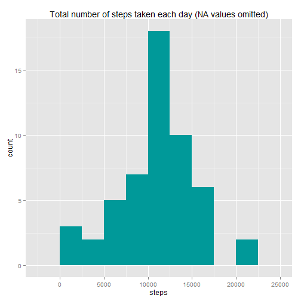
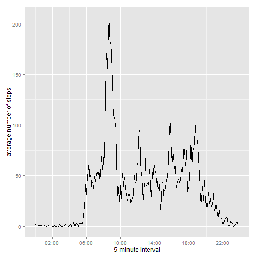
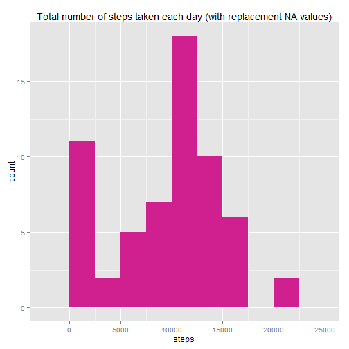
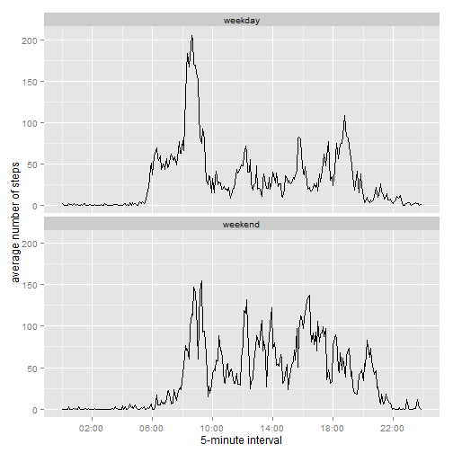

Reproducible Research - Peer Assessment 1
=========================================


This assignment makes use of data from a personal activity monitoring device. This device collects data at 5 minute intervals through out the day. The data consists of two months of data from an anonymous individual collected during the months of October and November, 2012 and include the number of steps taken in 5 minute intervals each day.

Data can be downloaded from [here](https://d396qusza40orc.cloudfront.net/repdata%2Fdata%2Factivity.zip). 

Before we begin to precess the data, we need to load required packages (`dplyr`, `ggplot2` and `scales`). We also need to set time locale to English (locale-specific conversions will affect names of the days later on).


```r
Sys.setlocale("LC_TIME", "English")

library(dplyr)
library(ggplot2)
library(scales)
```


##Loading and preprocessing the data

Data is loaded into data frame named df. Here is what the dataset looks like:


```r
df <- read.csv("./repdata-data-activity/activity.csv")
head(df) 
```

```
##   steps       date interval
## 1    NA 2012-10-01        0
## 2    NA 2012-10-01        5
## 3    NA 2012-10-01       10
## 4    NA 2012-10-01       15
## 5    NA 2012-10-01       20
## 6    NA 2012-10-01       25
```

This data frame consists of 17568 observations of 3 variables: 

- **steps**: Number of steps taking in a 5-minute interval (missing values are coded as `NA`)

- **date**: The date on which the measurement was taken in YYYY-MM-DD format

- **interval**: Identifier for the 5-minute interval in which measurement was taken

Both steps and interval are class integer. Variable date is class character so we will convert it into class Date.


```r
df$date <- as.Date(df$date, format="%Y-%m-%d")   
```


##What is mean total number of steps taken per day?

For this part of the assignment, missing values are removed from the dataset using `na.omit()` function. Data is then grouped by date and sum of each group is calculated to get total number of steps taken per day .


```r
totalSteps <- select(na.omit(df), -interval) %>% group_by(date) %>% summarise_each(funs(sum))
```

The following graph is a histogram of the total number of steps taken each day (without missing values).


```r
ggplot(data=totalSteps, aes(steps)) +
    geom_histogram(binwidth = 2500, fill="#009999") +
    ggtitle("Total number of steps taken each day (NA values omitted)")
```

 

Mean and median of the total number of steps taken per day are:


```r
withoutNAs <- data.frame(mean=mean(totalSteps$steps), median=median(totalSteps$steps), 
                         row.names="withoutNAs")
print(withoutNAs)
```

```
##                mean median
## withoutNAs 10766.19  10765
```


##What is the average daily activity pattern?

We will make a time series plot of the 5-minute interval (x-axis) and the average number of steps taken, averaged across all days (y-axis). 
In this part of assignment missing values are once again omitted. Calculated average number of steps for each 5-min interaval is stored in variable avgSteps.


```r
avgSteps <- select(na.omit(df), -date) %>% group_by(interval) %>% summarise_each(funs(mean))
```

Interval column in avgSteps is an integer array that represents time (hours and minutes), e.g. 110 stands for 01:10.  
Intervals go like this: 0, 5, 10, 15,...,50, 55, 100, 105,... 
Because R doesn't recognize that this is actually a time variable and that there is equal amount of time between 55 and 100 (00:55 and 01:00) as it is between 50 and 55 (00:50 and 00:55), it shows on the graph as a wider gap.
To avoid this we must convert these interval values to date-time class.

Following top two lines of code first add zeroes in front of each interval (where necessary) to make each interval 4 digits long (e.g. transforms 35 into 0035) and then it converts it into date-time class.


```r
avgSteps$interval <- sprintf("%04d", avgSteps$interval)   
avgSteps$interval <- as.POSIXct(avgSteps$interval, format="%H%M")

ggplot(data=avgSteps, aes(x=interval, y=steps)) +
    geom_line() +
    scale_x_datetime(breaks=date_breaks("4 hour"), labels=date_format("%H:%M")) +     #scales package
    xlab("5-minute interval") + 
    ylab("average number of steps")
```

 

Which 5-minute interval, on average across all the days in the dataset, contains the maximum number of steps?


```r
substr(filter(avgSteps, steps==max(steps))$interval, 12, 16)
```

```
## [1] "08:35"
```


##Imputing missing values

There are a number of days/intervals where there are missing values (coded as `NA`). The presence of missing days may introduce bias into some calculations or summaries of the data.

Total number of these values in the dataset (i.e. the total number of rows with `NA`s) is:


```r
sum(is.na(df$steps))
```

```
## [1] 2304
```

Now we will create a new dataset (called newdf) that is equal to the original dataset but with the missing data filled in. We will fill them in using median value for that interval.


```r
#calculate median for each interval
medianSteps <- select(na.omit(df), -date) %>% group_by(interval) %>% summarise_each(funs(median))

#fill missing values of steps with median for that interval
newdf <- merge(df, medianSteps, by="interval")
newdf$steps.x[is.na(newdf$steps.x)] <- newdf$steps.y[is.na(newdf$steps.x)]

newdf <- select(newdf, -steps.y)          #remove steps.y column
newdf <- rename(newdf, steps=steps.x)     #rename steps.x column as steps
```

Now we can use this new dataset with filled-in values to make a histogram of the total number of steps taken each day.


```r
newTotalSteps <- select(newdf, -interval) %>% group_by(date) %>% summarise_each(funs(sum))

ggplot(data=newTotalSteps, aes(steps)) +
    geom_histogram(binwidth = 2500, fill="violetred") +
    ggtitle("Total number of steps taken each day (with replacement NA values)")
```

 

Mean and median total number of steps taken per day (with replacement `NA`s) are:


```r
withReplacementNAs <- data.frame(mean=mean(newTotalSteps$steps), median=median(newTotalSteps$steps),
                        row.names="withReplacementNAs")
print(withReplacementNAs)
```

```
##                        mean median
## withReplacementNAs 9503.869  10395
```

Let us compare these values with those calculated in the first part of the assignment:


```r
rbind(withoutNAs, withReplacementNAs)
```

```
##                         mean median
## withoutNAs         10766.189  10765
## withReplacementNAs  9503.869  10395
```

We can notice that imputing missing data has lowered both mean and median estimates of the total daily number of steps. This is expected because there are lot of intervals where median value is 0.


##Are there differences in activity patterns between weekdays and weekends?

For this part of assignment we will use dataset with the filled-in missing values.
To be able to compare activity patterns between weekdays and weekend, we will create a new factor variable in the dataset called day with two levels – “weekday” and “weekend” indicating whether a given date is a weekday or weekend day. 

The following code first creates a new variable called day in newdf dataset and fills it with a correct day of week for each date using `weekdays()` function. Afterwards, it replaces each day of week with either "weekday" or "weekend". For example, it will replace "2012-10-01" first with "Monday" and then with "weekday".


```r
newdf$day <- weekdays(newdf$date)
logVect <- newdf$day=="Saturday" | newdf$day=="Sunday"  
newdf$day[logVect] <- "weekend"
newdf$day[!logVect] <- "weekday"
newdf$day <- factor(newdf$day)
```

Finally, here is a panel plot that compares activity between weekend and weekday. It contains two time series plots of the 5-minute interval (x-axis) and the average number of steps taken, averaged across all weekday days or weekend days (y-axis).  
For this graph, we used the same method of converting interval values into POSIX date-time class as we did for the previous time series plot.


```r
newAvgSteps <- select(newdf, -date) %>% group_by(day, interval) %>% summarise_each(funs(mean))

newAvgSteps$interval <- sprintf("%04d", newAvgSteps$interval)   
newAvgSteps$interval <- as.POSIXct(newAvgSteps$interval, format="%H%M")

ggplot(data=newAvgSteps, aes(x=interval, y=steps)) +
    geom_line() +
    facet_wrap(~day, nrow=2, ncol=1) +
    scale_x_datetime(breaks=date_breaks("4 hour"), labels=date_format("%H:%M")) +
    xlab("5-minute interval") + 
    ylab("average number of steps")
```

 


